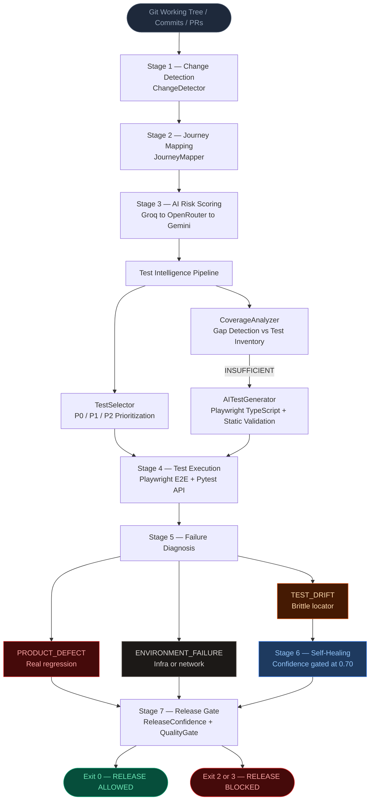
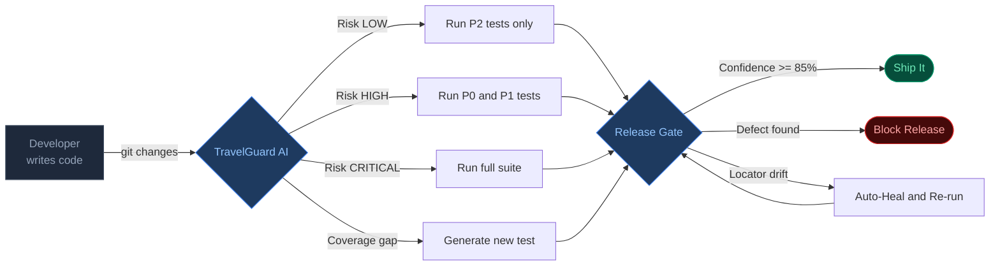

# TravelGuard AI

> **Autonomous QA Platform — From Code Commit to Release Gate, Powered by LLMs**

TravelGuard AI is an end-to-end autonomous quality engineering platform that detects code changes, maps them to business-critical user journeys, intelligently selects and executes tests, diagnoses failures, self-heals brittle locators, and enforces a mathematical release confidence gate — all without human intervention.

---

## The Problem

Modern travel applications ship fast, but QA does not scale. Traditional test suites are:
- **Slow** — engineers run everything, even when only a button changed.
- **Fragile** — UI locators drift, causing false failures that block releases.
- **Blind** — no system connects a code commit to its business-level risk.

Teams are left manually triaging test failures instead of shipping features.

---

## The Solution

TravelGuard AI acts as an **autonomous QA engineer** embedded directly in the developer workflow. It answers three questions automatically:

1. **What changed, and does it matter?** — AI-powered risk scoring mapped to real business journeys.
2. **Which tests should run?** — Intelligent P0/P1/P2 prioritization with full accounting.
3. **Can we ship?** — Mathematical release confidence score and a CI/CD quality gate with standard exit codes.

---

## Core Features

### Change Intelligence
- Detects diffs from git working tree, commit ranges, or CI pull requests.
- Maps file-level changes to **Business User Journeys** (Flight Search, Flight Selection, Passenger Details, Booking and Confirmation).
- Computes a transparent **Risk Score (0-100)** with an explainable risk tier: `LOW · MEDIUM · HIGH · CRITICAL`.

### Intelligent Test Orchestration
- Selects tests into prioritized tiers (**P0**, **P1**, **P2**) from a machine-readable test inventory.
- Detects **coverage gaps** and automatically generates candidate Playwright tests with static QA validation.
- Executes Playwright (E2E) and Pytest (API) suites with real-time browser inspection via a genuine **Model Context Protocol (MCP)** server.

### Autonomous Failure Diagnosis and Self-Healing
- Classifies every failure into exactly one root cause:
  - `TEST_DRIFT` — brittle locator, not a product bug.
  - `PRODUCT_DEFECT` — real regression; triggers a structured bug report.
  - `ENVIRONMENT_FAILURE` — infra/network issue; release blocked pending investigation.
- **Self-heals** `TEST_DRIFT` failures (confidence-gated >= 0.70, safe backup created, re-validated). Strictly refuses to mask real product bugs.

### Mathematical Release Confidence and Quality Gate
- Computes a **Release Confidence Score (0-100%)** with an explicit audit formula.
- Enforces a deterministic CI/CD quality gate with standard exit codes:

| Exit Code | Verdict | Meaning |
|-----------|---------|---------|
| `0` | `RELEASE ALLOWED` | All tests passed or healed with confidence >= 85% |
| `2` | `RELEASE BLOCKED` | Real product defect detected |
| `3` | `RELEASE BLOCKED` | Environment / infrastructure failure |
| `4` | `RELEASE BLOCKED` | Unclassified or low-confidence failure |

### Resilient 3-Tier LLM Hierarchy
All AI reasoning flows through an observable fallback router with zero secret leakage:

| Tier | Provider | Role |
|------|----------|------|
| **Primary** | Groq | Ultra-fast primary reasoning |
| **Fallback 1** | OpenRouter | Secondary provider |
| **Fallback 2** | Gemini | High-capacity tertiary fallback |

### Production Observability
- Prometheus metrics exposed at `GET /api/metrics` (runs, gate decisions, confidence scores, heals, defects).
- OpenTelemetry distributed tracing.
- Pre-configured Grafana dashboard (`observability/grafana/dashboard.json`).

---

## Interactive Developer Console

A full-featured web dashboard at `http://localhost:5173` lets developers interact with TravelGuard AI in real time:

- **One-click scenario triggers** — run pre-built demos covering UI drift, API defects, environment failures, and new feature coverage gaps.
- **Live Pre-Commit Check** — analyzes uncommitted local git changes instantly.
- **7-stage visual pipeline stepper** — animated live progress through every autonomous stage.
- **In-console test runner** — execute individual tests with live pass/fail badges directly from the UI.
- **Full autonomous pipeline (Stages 4-7)** — trigger test execution, diagnosis, self-healing, and release gating from a single button click.
- **Visual self-healing diff viewer** — see old locator replaced by repaired locator with re-validation status.
- **AI test generator playground** — browse generated Playwright TypeScript tests with a 1-click copy button.
- **Release verdict banner** — glowing emerald for `RELEASE ALLOWED`, vibrant rose for `RELEASE BLOCKED`.

---

## Architecture

### Autonomous 7-Stage Pipeline



### Developer Workflow Overview



---

## Tech Stack

| Layer | Technology |
|-------|-----------|
| **Backend** | Python, FastAPI, Uvicorn |
| **Frontend** | React, TypeScript, Vite |
| **E2E Testing** | Playwright (TypeScript) |
| **API Testing** | Pytest |
| **AI / LLM** | Groq, OpenRouter, Gemini (3-tier fallback) |
| **Browser Automation** | Playwright MCP (JSON-RPC 2.0 stdio) |
| **Observability** | Prometheus, OpenTelemetry, Grafana |
| **CI/CD** | GitHub Actions |

---

## Quick Start

### Prerequisites
- Python 3.11+
- Node.js 18+
- API key for at least one LLM provider (Groq recommended)

### 1. Clone and Install

```bash
git clone https://github.com/your-org/TravelGuard-AI.git
cd TravelGuard-AI

# Install Python dependencies
pip install -r requirements.txt

# Install frontend dependencies
cd frontend && npm install && cd ..

# Install Playwright browsers
npx playwright install
```

### 2. Configure Environment

```bash
cp .env.example .env
# Edit .env and add your API keys
```

### 3. Start the Application

**Backend:**
```bash
uvicorn app.main:app --app-dir backend --host 127.0.0.1 --port 8000 --reload
```
API at `http://localhost:8000` | Docs at `http://localhost:8000/docs`

**Frontend:**
```bash
cd frontend && npm run dev
```
App + Developer Console at `http://localhost:5173`

---

## Demo Scenarios

### Via Developer Console (Browser)
Navigate to `http://localhost:5173` and open the **TravelGuard Dev Console**. Click any scenario trigger button to see the full 7-stage autonomous pipeline run live.

### Via CLI

```bash
# Cosmetic UI change -> Risk: LOW, P2 selected
python -m travelguard analyze --demo scenario_a

# Booking form change -> Risk: HIGH, P0 selected
python -m travelguard analyze --demo scenario_b

# Booking API change -> Risk: CRITICAL, P0 selected
python -m travelguard analyze --demo scenario_c

# New feature (Promo Code) -> Coverage gap detected -> Playwright test generated
python -m travelguard analyze --demo scenario_d

# Analyze your actual uncommitted local changes
python -m travelguard analyze

# Machine-readable JSON output for CI integration
python -m travelguard analyze --demo scenario_d --json
```

### Autonomous Pipeline (Full Stages 4-7)

```bash
# UI Locator Drift -> Self-Heals -> RELEASE ALLOWED (Exit Code 0)
python -m travelguard autonomous-demo --demo booking-ui-drift --mock-llm

# Backend 500 Defect -> PRODUCT_DEFECT -> RELEASE BLOCKED (Exit Code 2)
python -m travelguard autonomous-demo --demo booking-api-defect --mock-llm

# Environment Offline -> RELEASE BLOCKED (Exit Code 3)
python -m travelguard autonomous-demo --demo environment-failure --mock-llm
```

---

## Repository Structure

```
TravelGuard-AI/
├── .github/workflows/qa.yml         # CI/CD autonomous QA quality gate
├── travelguard/                     # TravelGuard Intelligence Core
│   ├── autonomous_pipeline.py       # End-to-end autonomous QA orchestrator
│   ├── analyzer.py                  # AI change analyzer with LLM routing
│   ├── change_detector.py           # Git working tree and commit diff detection
│   ├── diagnosis_engine.py          # TEST_DRIFT / PRODUCT_DEFECT / ENV classification
│   ├── execution_engine.py          # Playwright / Pytest dual-mode runner
│   ├── healing_engine.py            # Confidence-gated self-healing engine
│   ├── quality_gate.py              # Deterministic CI/CD release gate
│   ├── release_confidence.py        # Mathematical confidence scoring engine
│   ├── risk_engine.py               # Transparent 0-100 risk scoring
│   ├── test_generator.py            # Grounded Playwright test generator
│   ├── test_selector.py             # P0/P1/P2 intelligent test selector
│   ├── mcp_server.py                # Genuine Playwright MCP server (JSON-RPC 2.0)
│   ├── journeys.yaml                # Business Journey Registry
│   ├── test_inventory.yaml          # Machine-readable test catalog
│   └── tests/                       # Unit and integration test suite
├── frontend/src/travelguard/        # Developer Console (React + TypeScript)
├── backend/app/                     # FastAPI backend (flights, booking, LLM, metrics)
├── tests/                           # Playwright E2E test suite
├── observability/grafana/           # Pre-configured Grafana dashboard
└── .env.example                     # API key configuration template
```

---

## Running Tests

```bash
# Full Python test suite (unit, intelligence and integration)
python -m pytest

# Specific subsystems
python -m pytest travelguard/tests/test_autonomous_pipeline.py -v
python -m pytest travelguard/tests/test_quality_gate.py -v
python -m pytest travelguard/tests/test_release_confidence.py -v

# Playwright E2E suite
cd tests && npx playwright test
```

---

## CI/CD Integration

The GitHub Actions workflow (`.github/workflows/qa.yml`) runs the full autonomous quality gate on every push and pull request:

1. Installs dependencies and starts the SUT (SkyBook).
2. Executes `python -m travelguard autonomous-run --quality-gate`.
3. Fails the pipeline on exit code `2`, `3`, or `4`.
4. Archives quality reports and Playwright traces as build artifacts.

---

## Environment Variables

| Variable | Description | Required |
|----------|-------------|----------|
| `GROQ_API_KEY` | Groq API key (primary LLM) | Yes (or any one provider) |
| `GROQ_MODEL` | Groq model override | No |
| `OPENROUTER_API_KEY` | OpenRouter API key (Fallback 1) | No |
| `OPENROUTER_MODEL` | OpenRouter model override | No |
| `GEMINI_API_KEY` | Gemini API key (Fallback 2) | No |
| `GEMINI_MODEL` | Gemini model override | No |

Health check: `GET /api/llm/health` reports all provider statuses without exposing credentials.

---

## Built For

**Amadeus Hackathon** — demonstrating how AI can autonomously close the gap between development velocity and software quality in the travel industry.

---

*TravelGuard AI — Ship with confidence, not with fingers crossed.*
